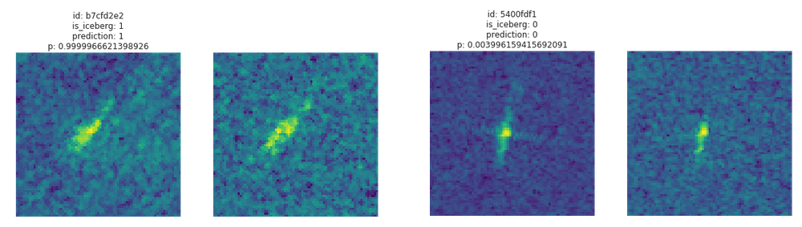

# Statoil Iceberg Detection
Solution for Kaggle competition [Statoil/C-CORE Iceberg Classifier Challenge](https://www.kaggle.com/c/statoil-iceberg-classifier-challenge)



## Overview
The aim of the competition is to classify images as icebergs/ships.

I used different models build in Tensorflow to address the problem.

## Install
Project is organized as a python package. So first you should install it, best with development mode.

```bash
python setup.py develop
```

Data are stored in separate folder so set the variable `BASE_DIR` in [statoil/cfg.py](statoil/cfg.py#L3) to your data dir.

## Project structure

Source files:
- [scripts/](scripts/) Contains app entrypoints.
  - [scripts/prepare_data.py](scripts/prepare_data.py) Runs the preprocessing pipeline 
  - [scripts/train.py](scripts/train.py) Train a model. Takes a configuration file which contains a a model class and hyperparametrs to use with the model.
  - [scripts/hypertrain.py](scripts/hypertrain.py) Special version of a a `train.py` with a possibility to seach hyperparametrs.
  - [scripts/predict.py](scripts/predict.py) Uses a trained model to predict a testset to submit to Kaggle.
- [statoil/models/](statoil/models/) Contains definition of models
- [conf/](conf/) Contains configuration files
- [notebooks/](notebooks)
  - [notebooks/data_examine.ipynb](notebooks/data_examine.ipynb) To see the data before doing anything else
  - [notebooks/eval.ipynb](notebooks/Eval.ipynb) Notebook for evaluation, see errors, confusion matrix, etc.

  
Data files:
- `BASE_DIR` Dir with data
  - `BASE_DIR/raw/` Constains raw data downloaded from Kaggle.
  - `BASE_DIR/DATAxx/` Preprocessed data. `xx` is a version of data. 
  - `BASE_DIR/models/` Dir that contains downloaded models from tensorflow/slim library used for transfer learning.
  - `BASE_DIR/experiments/` Experiment results. Folders are created here after train.py executed.
  


## Preprocessing
[Download data](https://www.kaggle.com/c/statoil-iceberg-classifier-challenge/data) and unzip in `BASE_DIR/raw/` (without subfolders).

By the folowing script data are split to `train` and `dev` datasets. These datasets also expanded by flipping and rotation.

```bash
python scripts/prepare_data.py
``` 

## Run experiment
Train:
```bash
CUDA_VISIBLE_DEVICES=0 python scripts/train.py --conf conf/simple_cnn.json --exp simple_cnn --long_run
```

Predict:
```bash
CUDA_VISIBLE_DEVICES=0 python scripts/predict.py --exp simple_cnn
```

## Best results
[Best results](conf/conf_best.json) achieved log_loss on dev_set = 0.1963, on test_set = 0.1946.  

## What I tried
 - Training on traindev set before submit: :(
 - Batch normalization :(
 - Pretrain network on a sythetic data :(
 - Transfer learning :(
 - Dense net :(
 - Hyperparameter tuning :)
 


